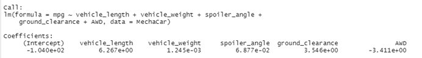
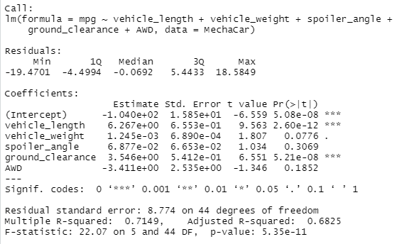
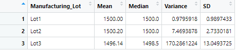

# MechaCar_Statistical_Analysis

## Linear Regression to Predict MPG
The MechaCar_mpg.csv dataset contains mpg test results for 50 prototype MechaCars. The MechaCar prototypes were produced using multiple design specifications to identify ideal vehicle performance. Multiple metrics, such as vehicle length, vehicle weight, spoiler angle, drivetrain, and ground clearance, were collected for each vehicle. Using lm(), we created a linear regression model that predicts the mpg of MechaCar prototypes using several variables from the MechaCar_mpg.csv file (Fig. 1) and using summary(), we are able to determine the p-value and r-squared value (Fig 2): 

Fig.1 - Linear Regression Model

Fig.2 - Linear Regression Model: p-value and r-squared value

Using the results above, we are able to answer the following questions:

**Which variables/coefficients provided a non-random amount of variance to the mpg values in the dataset?**

From our linear regression output in Fig. 1, one can notice that the slope of vehicle_length and ground_clearance are significantly larger than the other variables/coefficients. Additionally, looking at our results in Fig. 2, each Pr(>|t|) value represents the probability that each coefficient contributes a random amount of variance to the linear model. This means that if the p-value is less than a certain significance level, then the predictor variable is said to have a statistically significant relationship with the response variable in the model. As shown in Fig. 2, both vehicle_length and ground_clearance are noted to have p-values less than the indicated significance level of 5%. Therefore, we can say that both vehicle_length and ground_clearance provide a non-random amount of variance to the mpg values in the dataset.

**Is the slope of the linear model considered to be zero? Why or why not?**

The linear regression model based on Fig. 1 is:
mpg = 6.27 * vehicle_length + 1.25e-3 * vehicle_weigth + 6.88e-2 * spoiler_angle + 3.55 * ground_clearance - 3.41 * AWD - 1.04e+2

Because the coeffiecients of each variable is a non-zero value, we could say that the slope of the linear model is not considered to be zero, though our negative coefficient value for AWD may not indicate this to be entirely accurate. However, based on our P-value of 5.35e-11, which is smaller than our assumed significance level of 5% (meaning we would reject a null hypothesis stating slope=0) , we can confidently say that the slope of our linear model is not zero.

**Does this linear model predict mpg of MechaCar prototypes effectively? Why or why not?**

Based on our results in Fig. 2, one can note that the R-squared value is equal to 0.7149, or approximately 71%. This means that this linear model will accurately predict mpg MechaCar prototypes approximately 71% of the time. Though not great, we can still consider this linear model as fairly effective to predict mpg of MechaCar prototypes.

## Summary Statistics on Suspension Coils

In this dataset, the weight capacities of multiple suspension coils were tested to determine if the manufacturing process is consistent across production lots. We created a summary statistics table to show:

- The suspension coil’s PSI continuous variable across all manufacturing lots.

Fig.3 - Summary Statistics of the suspension coil’s PSI column

- The following PSI metrics for each lot: mean, median, variance, and standard deviation.

Fig.4 - Summary statistics on PSI of the suspension coils per lot

**Does the current manufacturing data meet this design specification for all manufacturing lots in total and each lot individually? Why or why not?**

The design specifications for the MechaCar suspension coils dictate that the variance of the suspension coils must not exceed 100 pounds per square inch. From, Fig. 3, the summary statistics across all manufacturing lots indicates that the variance is 62.29356, which is less than 100 PSI, which meets the design specification. However, in Fig. 4, we can see that variance of the suspension coils in Lot1 (0.98 PSI) and Lot2 (7.47 PSI) meet these requirements, but Lot3 is 170.29 which is significantly higher than 100 is definitely not meeting the design specification. 
